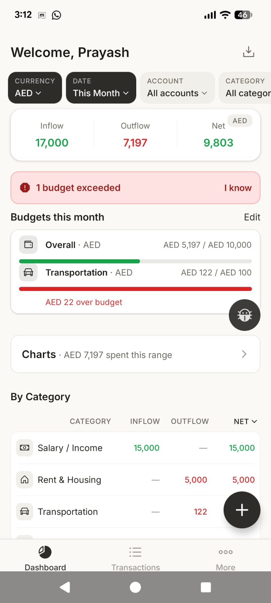
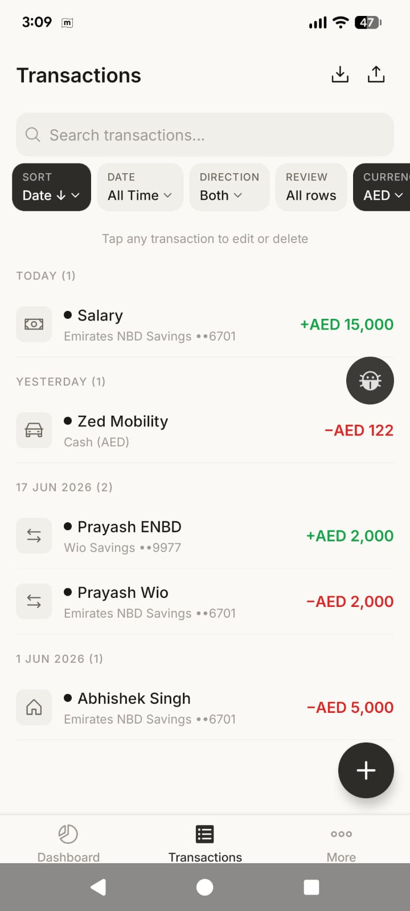
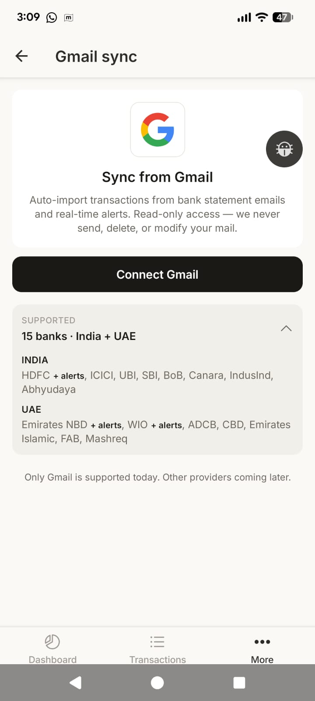
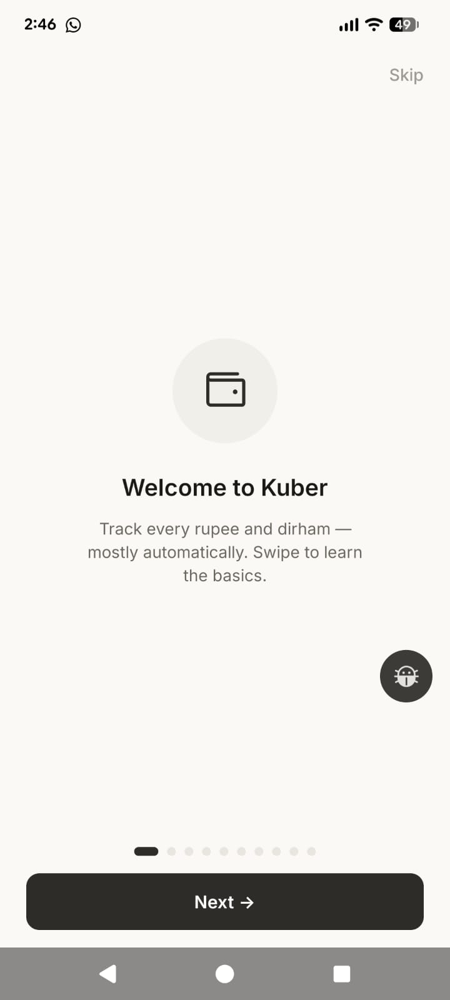

# Kuber 💰

**Track every rupee and dirham in one place — your money, on your phone, private by default.**

Kuber is a personal finance and expense tracker for Android. It pulls together your income and spending across multiple accounts and currencies (INR and AED), sorts it into categories automatically, and shows you where your money actually goes — without you having to type in every transaction by hand.

Built by an indie developer, currently in beta.

---

## ✨ Key features

- **Four ways to get your transactions in** — type them manually, import a PDF or Excel bank statement, or let Kuber read bank statement and transaction-alert emails straight from your Gmail. Whatever's easiest for you.
- **Multi-account, multi-currency** — keep separate accounts and balances, and track both Indian Rupees (INR) and UAE Dirhams (AED) side by side.
- **Smart auto-categorisation** — Kuber learns from how you label things and gets better over time. The learning happens on your device.
- **Works with 15+ Indian & UAE banks** — major banks across India and the UAE are supported (HDFC, ICICI, SBI, Emirates NBD, Wio, and more).
- **Budgets** — set spending limits per category and see how you're tracking through the month.
- **Dashboards & charts** — clear visual summaries of where your money is going.
- **Export anytime** — download your data as CSV or Excel whenever you want. It's your data.
- **Optional cloud backup** — back up and restore across devices only if you choose to. Off by default.

---

## 📸 Screenshots

| | |
|---|---|
|  |  |
| *Dashboard — your money at a glance, with budgets* | *Transactions — searchable & auto-categorised* |
|  |  |
| *Gmail sync — auto-import statements & alerts* | *Quick onboarding when you first open the app* |

---

## 📥 Download

Kuber is available as an Android app (APK). There is no Play Store listing or iOS version yet.

1. **Download the latest APK:** **[⬇️ Download Kuber v1.0.0 (APK)](https://github.com/prayashadhia/kuber-app/releases/latest)**
2. **Requirements:** Android 7.0 or later.
3. **Install note:** Because Kuber isn't on the Play Store yet, your phone may warn you about installing from an "unknown source." This is normal for apps installed outside the store. You'll need to allow installation from your browser or file manager when prompted, then open the downloaded file to install.

---

## 📧 Using Gmail sync (important)

Kuber can read your bank statement emails and transaction alerts from Gmail and turn them into transactions — but there's one step you need to know about first.

Kuber's Google sign-in is currently in **test mode** (the app hasn't gone through Google's full verification yet). Because of this, **Gmail sync only works for Google accounts that have been added to an approved list.**

**To use Gmail sync:**

1. **Message me on LinkedIn** (https://www.linkedin.com/in/prayash-adhia/) with the Gmail address you want to connect.
2. Wait for confirmation that your address has been added to the allowlist.
3. Open Kuber, go to the Gmail sync screen, and sign in with that same Gmail account.

If you skip this step, Google will block the sign-in. Manual entry and file imports work without any of this — Gmail sync is the only feature that needs the allowlist.

---

## 🔒 Privacy

- **On-device first.** Your financial data lives on your phone by default. Nothing is uploaded unless you turn on backup.
- **Optional cloud backup.** If you choose to enable it, your data is backed up so you can restore it later or move to a new device. This is entirely opt-in.
- **What Kuber touches.** When you use Gmail sync, Kuber reads only the bank emails it needs to build your transaction list. When you import a file, it reads only that statement. You're always in control of what comes in.

---

## 🚦 Status

- **Beta.** Actively being built and improved — expect rough edges, and please send feedback.
- **Android only.** No iOS app and no Play Store listing yet.

---

## 💬 Contact / feedback

- **LinkedIn:** https://www.linkedin.com/in/prayash-adhia/ — DM me to request Gmail access or to send feedback.
- **In-app bug reporter:** Kuber has a built-in bug reporter — tap the floating bug button on any screen to send a report (with a screenshot and logs) directly to the developer.

Your feedback genuinely shapes what gets built next. Thank you for trying Kuber!
